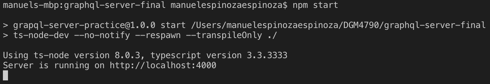
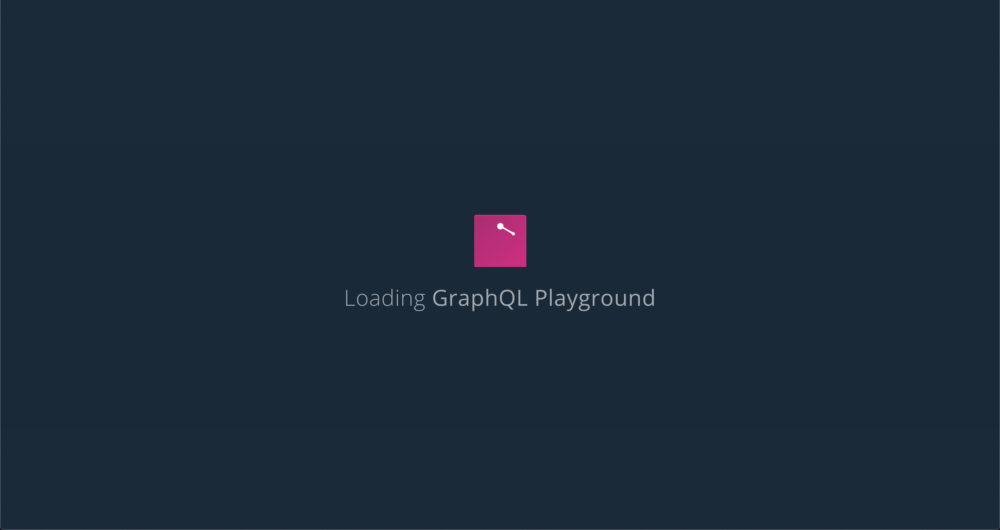
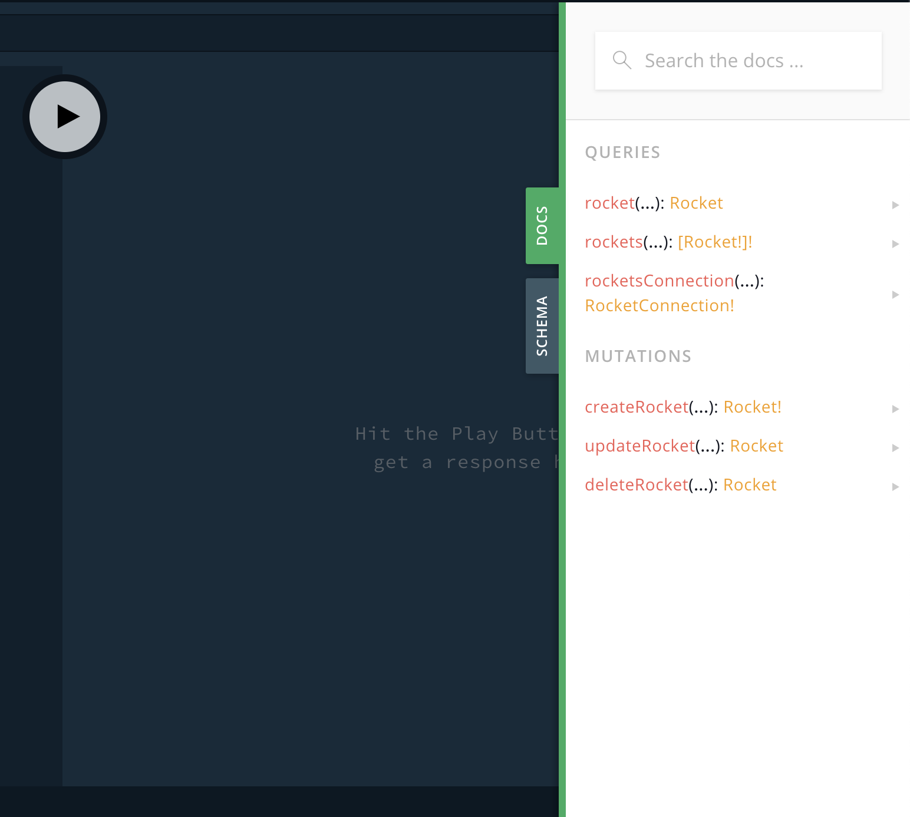

## graphql-server

# Start up your server
`npm dockerStart`

# Deploy Prisma
`npm run deploy`

*Server is running on http://localhost:4000*

## Start your playground
`npm start`

### *check docs

## Seed
`npm run load`

## Reset 
`npm run reset`